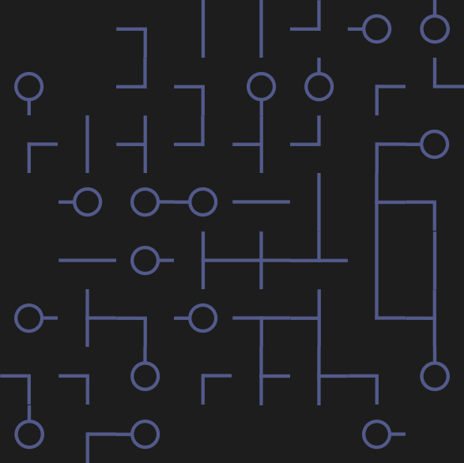
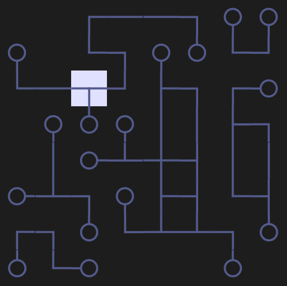

# Concepts of Infinity Loop

(That's how the game works)

## The game

Infinity loop is a puzzle game built out of a grid of tiles, each with a particular set of connections pointing to orthogonal neighboring tiles. To solve the puzzle, the user must rotate individual tiles to match the connection of all neighboring tiles. The following two images help to demonstrate the visually intuitive ruleset.

**Example of a puzzle:**

**And its solution:**

Note: A given puzzle may have multiple valid solutions.

**Component Overview:**

* Basic game as [WASM](https://webassembly.org/) Web-UI
* Generating levels with either a
  * unweighted generator, which generates all possible levels with even distribution
  * generator based on [Wave Function Collapse](https://github.com/mxgmn/WaveFunctionCollapse)
* Solving arbitrary puzzle levels with either a
  * solver based on [Constraint Propagation](https://en.wikipedia.org/wiki/Constraint_satisfaction)
  * SAT solver
* Manual level editor
* Help during solving by requesting hints

The following section further elaborates on each component. For an overview of the employed architecture and file structure, refer to the [architecture](architecture.md) file.

## Basic game representation / implementation

`EnumSet` is an both space and performance optimized representation of a set data structure by relating / associating values with a specific bit in a bit array. The to possible values of a bit `0` and `1` indicate inclusion in the set. For a type to be eligible to being used in a `EnumSet` requires a bijection between values of the type and the natural numbers. (see the Finite trait)

The fundamental component of interaction in **Infinity Loop** is the `Tile`, which is rotated by the user to solve the puzzle. Conceptually a single tile holds the connection information to its neighbors as a set of directions.

`Tile` is a newtype wrapper over an `EnumSet` of directions: `struct Tile<A>(EnumSet<A>)`. Directions correlate to the shape of the tile: `enum Square { Up, Right, Down, Left }`

The rectangular gameboard is modeled by `Grid`, which lines up tiles in a grid structure.

*TestLevel* contains some predefined levels for tutorial or test cases. It provides a bunch of gameboards, represented as hardcoded strings, and a deserialization method to create a corresponding Grid.

The progressive change in generated levels is provided by a lazy iterator defined through a [stream unfold](https://en.wikipedia.org/wiki/Anamorphism) in **levelstream**.

## The UI

Developer: Johannes Reichle

## Level Generator

### Unweighted Generator

Developer: Simon Redl

### The Wave Function Collapse (WFC) Generator

Developer: Alexander Jensen

Wave function collapse is the process by which a system changes from a superposition of states to a discrete state with a clearly defined value of a given measurable quantity by interacting with its environment.

Wave function collapse occurs when a wave function—initially in a superposition of several eigenstates—reduces to a single eigenstate due to interaction with the external world. - [Wiki](https://en.wikipedia.org/wiki/Wave_function_collapse)

## Level Solver

### Constraint Propagation Solver

Developer: Simon Redl

for general idea behind the solver see [Propagators](https://qfpl.io/share/talks/propagators/slides.pdf)

lazily generates all possible solutions for arbitrary levels
strategy: superimpose all possible tiles at each position and successively eliminate them by propagating constraints to neighbors until solved

### SAT-Solver

Developer: Jakob Ritter

1. encode tile configurations and game logic in CNF
2. solve by external SAT-solver
3. decode returned variables

## The Level Editor

Developer: Johannes Moosburger

This part shall provide a editor page, where the user can create his/her own level gameboards. For that, the user can specify a grid (width/height), add tiles of different shapes and rotate them, to shape a initial level pattern. Furthermore, the board can be tested with both the custom and the SAT-solver, to check, whether the level is a valid one or not. At last, it can be continued with the solving of the puzzle.

Optional: The gameboard can be serialized, to replay it in another session.

TODO: können wir auch den schwierigkeitsgrad bestimmen?
